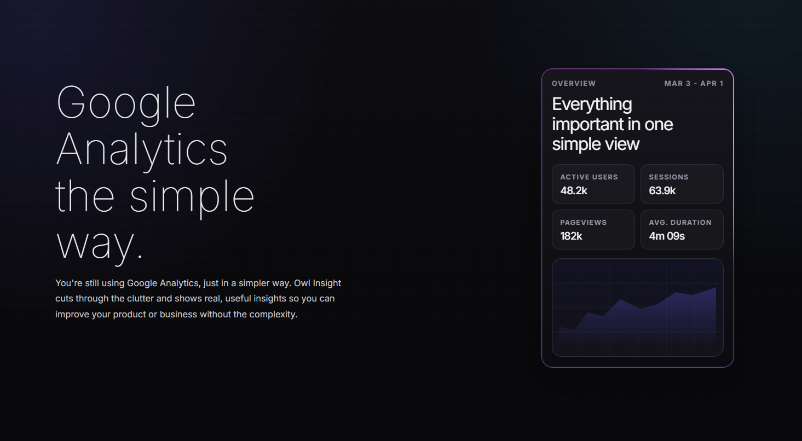
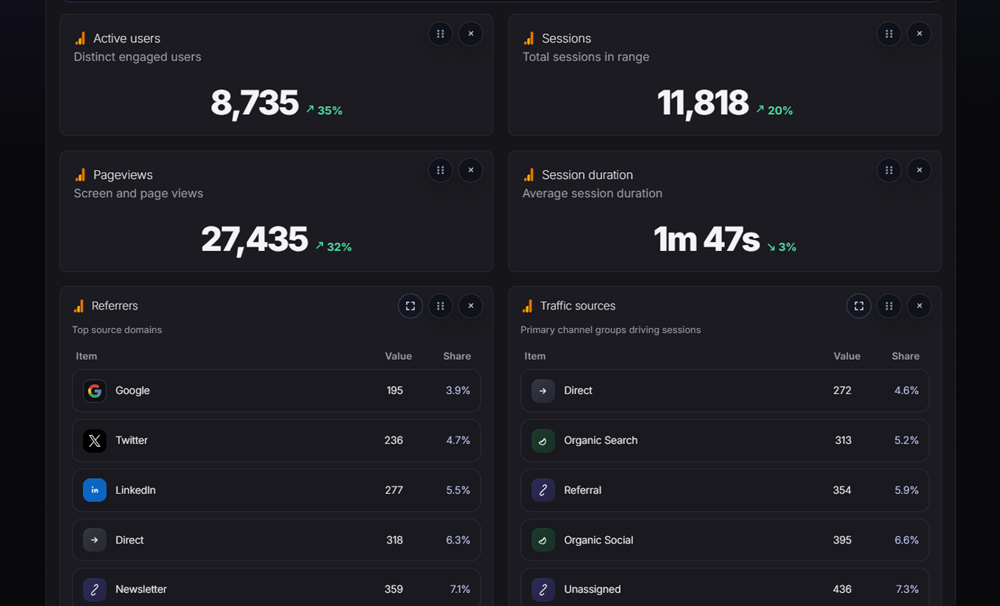

# OwlInsight

[Visit Website](https://owlinsight.dev/) | [View Demo](https://owlinsight.dev/demo) | [Pricing](https://owlinsight.dev/pricing) | [How It Works](https://owlinsight.dev/how-it-works) | [Read Article](https://owlinsight.dev/blog/google-analytics-alternative)

OwlInsight is a cleaner way to read Google Analytics.

If you are searching for a Google Analytics alternative, this is the important part: OwlInsight is not trying to replace your GA4 setup, replace your tags, or make you migrate to a new analytics stack. It sits on top of the Google Analytics data you already trust and shows it in a simpler dashboard.

So yes, OwlInsight is an alternative to the default Google Analytics interface. But it is not a full replacement for Google Analytics itself.

## What OwlInsight does

- Shows Google Analytics data in a simpler, calmer interface
- Lets teams review multiple properties in one place
- Brings key Google Search Console views into the same workspace
- Turns dashboard widgets into readable AI reporting
- Supports export and shareable reports
- Keeps your existing GA4 setup in place

## What OwlInsight does not do

- It does not replace Google Analytics tracking
- It does not ask you to rebuild your analytics setup
- It does not require a second tracking script
- It does not move your team to a completely different analytics product

## Why people use it

Google Analytics is powerful, but the day-to-day reporting experience can feel heavier than it needs to be.

OwlInsight is for teams that still want Google Analytics data, but want a faster way to scan traffic, pages, devices, countries, channels, and Search Console signals without digging through the default GA interface every time.

## Dashboard preview

## Best fit

OwlInsight is a good fit for:

- agencies managing several client properties
- marketers who need a cleaner GA4 reporting workflow
- founders who want quick answers from Google Analytics data
- teams that want Google Analytics and Search Console in one view

## Useful links

- Website: https://owlinsight.dev/
- Demo: https://owlinsight.dev/demo
- Pricing: https://owlinsight.dev/pricing
- About: https://owlinsight.dev/about
- How it works: https://owlinsight.dev/how-it-works
- Support: https://owlinsight.dev/support
- Contact: https://owlinsight.dev/contact
- Blog: https://owlinsight.dev/blog
- Google Analytics alternative article: https://owlinsight.dev/blog/google-analytics-alternative

## Public repo note

This repository is public for product visibility, screenshots, backlinks, and updates.

The production application source code is not included here.

If you want to try OwlInsight, start here:

## View Demo

https://owlinsight.dev/demo
